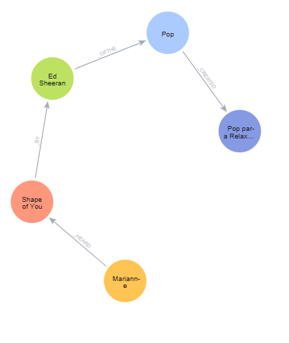

# 🎵 Graph-Based Music Recommendation System

Sistema de recomendação de músicas baseado em grafos, utilizando Neo4j e Cypher, com suporte à aplicação de algoritmos de Graph Data Science (GDS) para descoberta de padrões de escuta e recomendação personalizada.

## 📌 Visão Geral

Este projeto modela um domínio musical por meio de um grafo semântico, onde usuários, músicas, artistas, gêneros e playlists são representados como nós, e suas interações como arestas rotuladas.

O objetivo é demonstrar como bancos de dados orientados a grafos podem ser utilizados para:

Representar relações complexas

Identificar similaridade entre usuários e conteúdos

Apoiar sistemas de recomendação modernos

## 🧠 Tecnologias Utilizadas

Neo4j (Banco de Dados em Grafo)

Cypher Query Language

Neo4j Graph Data Science (GDS)

Modelagem conceitual orientada a grafos

## 🧩 Modelagem do Grafo
### Tipos de Nós
| Nó         | Descrição                    |
| ---------- | ---------------------------- |
| `User`     | Usuário da plataforma        |
| `Music`    | Faixa musical                |
| `Artist`   | Artista                      |
| `Genre`    | Gênero musical               |
| `Playlist` | Playlist criada por usuários |

### Tipos de Relacionamentos
| Relacionamento     | Origem → Destino | Significado           |
| ------------------ | ---------------- | --------------------- |
| `LISTENED`         | User → Music     | Interação de escuta   |
| `LIKED`            | User → Music     | Preferência explícita |
| `FOLLOW_ARTIST`    | User → Artist    | Afinidade             |
| `CREATED`          | Artist → Music   | Autoria               |
| `BELONGS_TO`       | Music → Genre    | Classificação         |
| `CREATED_PLAYLIST` | User → Playlist  | Criação               |
| `HAS_MUSIC`        | Playlist → Music | Curadoria             |

## 🏗 Exemplo de Criação do Grafo
CREATE
(u:User {
  userId: 1,
  name: "Marianne",
  age: 30,
  country: "BR"
}),
(m:Music {
  musicId: 101,
  title: "Shape of You",
  releaseYear: 2017,
  popularity: 95
}),
(a:Artist {
  artistId: 201,
  name: "Ed Sheeran"
}),
(g:Genre {
  name: "Pop"
}),
(p:Playlist {
  playlistId: 1001,
  name: "Pop para Relaxar",
  createdAt: date(),
  isPublic: true,
  mood: "Relax"
});

## 🔗 Criação das Conexões Semânticas
CREATE
(u)-[:LISTENED {count: 15, lastPlayed: date()}]->(m),
(u)-[:LIKED {date: date()}]->(m),
(u)-[:FOLLOW_ARTIST {since: 2022}]->(a),
(a)-[:CREATED]->(m),
(m)-[:BELONGS_TO]->(g),
(u)-[:CREATED_PLAYLIST]->(p),
(p)-[:HAS_MUSIC {position: 1, addedAt: date()}]->(m);

## 🔍 Consultas de Recomendação (Exemplo)
MATCH (u:User)-[:LISTENED]->(m:Music)<-[:LISTENED]-(other:User)-[:LISTENED]->(rec:Music)
WHERE u.userId = 1 AND NOT (u)-[:LISTENED]->(rec)
RETURN rec.title, COUNT(*) AS relevance
ORDER BY relevance DESC;

